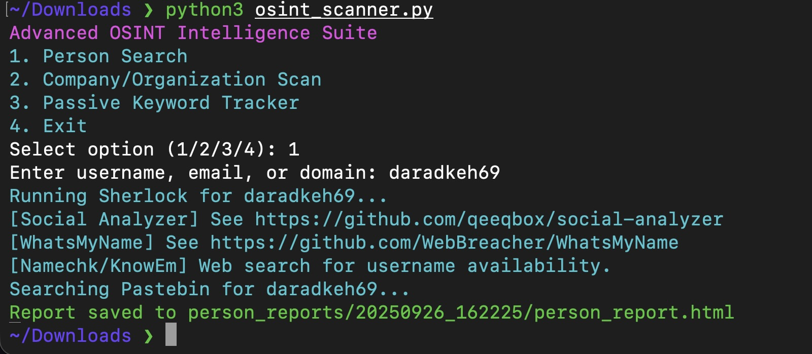

# 🕵️‍♂️ OSINT Scanner 


[](www.linkedin.com/in/daradkehh)

Modular Python OSINT framework for **person, company, and keyword reconnaissance** with HTML reporting and API integrations.

---

## ✨ Features

### 👤 Person Search
- Username checks via **Sherlock**, **Social Analyzer**, **WhatsMyName**, **Namechk**, **KnowEm**, and more  
- Email & domain reconnaissance (placeholders for **theHarvester**, **HIBP**, **Dehashed**)  
- Pastebin and breach lookups  
- Generates modern, interactive HTML reports  

### 🏢 Company / Organization Scan
- Integrates with **Shodan**, **WHOISXML**, and **Hunter.io** APIs  
- (Planned) **theHarvester** integration  
- Automated HTML reporting  

### 🔎 Passive Keyword Tracking *(Coming Soon)*
- RSS monitoring & alerting  
- Lightweight HTML tracking dashboards  

### ⚙️ Utilities
- **Tor / Proxy support** for anonymity  
- **Colorful CLI output**  
- **Timestamped reports** in neatly organized folders  

---
## Test on myself


---
### 🚀 Installation

Clone the repository:
```bash
git clone https://github.com/daradkeh69/osint-scanner.git
cd osint-scanner
```
Install dependencies:
```bash
pip install -r requirements.txt
```
Install recommended external tools: <br>
	•	Sherlock <br>
	•	Social Analyzer <br>
	•	WhatsMyName <br>
	•	theHarvester <br>

---

### 🔑 API Setup

Edit osint_scanner.py and replace placeholders with your API keys:

```bash
SHODAN_API_KEY   = "YOUR_SHODAN_API_KEY" 
WHOISXML_API_KEY = "YOUR_WHOISXML_API_KEY" 
HUNTER_API_KEY   = "YOUR_HUNTER_API_KEY" 
HIBP_API_KEY     = "YOUR_HIBP_API_KEY" 
DEHASHED_API_KEY = "YOUR_DEHASHED_API_KEY"
```

Shodan: (https://developer.shodan.io/api) <br>
WHOISXML: (https://whois.whoisxmlapi.com/api/documentation) <br>
Hunter.io: (https://hunter.io/api) <br>
HaveIBeenPwned: (https://haveibeenpwned.com/API/v3) <br>
Dehashed: (https://www.dehashed.com/docs/api)

---

### 📖 Usage

Run the tool:

```bash
python osint_scanner.py
```

You’ll see:

1. Person Search
2. Company/Organization Scan
3. Passive Keyword Tracker
4. Exit

Examples:<br> <br>
	•	Person Search: enter a username, email, or domain <br>
	•	Company Scan: enter a domain (e.g., example.com) <br>
	•	Keyword Tracker: enter a keyword/subject <br>

Reports are saved automatically in timestamped folders, e.g.:

```bash
person_reports/<date>_<id>/person_report.html
```

---

### 🧩 Extending & Customizing <br>
	•	Add new modules/API integrations by following the structure in osint_scanner.py.
	•	Extend the save_report function to support new output formats (PDF, Markdown, etc).
	•	Wrap the CLI for batch automation or import functions into your own projects.

---

### 📦 Requirements <br>
	•	Python 3.7+
	•	See requirements.txt for dependencies
	•	External tools (optional but recommended)

---

### ⚠️ Disclaimer

> **This tool is for educational and authorized security testing only.**
>
> - **Do NOT scan targets without explicit permission.**
> - **You may NOT copy, redistribute, or claim credit for this code.**
> - Commercial use, code reuse, or derivative works are strictly prohibited.
>
> _If you find this useful, please star the repo and give credit!_

---

### 📜 License

MIT License

---

## 👨‍💻 Author: daradkeh69

[](www.linkedin.com/in/daradkehh) • [GitHub](https://github.com/daradkeh69) 
